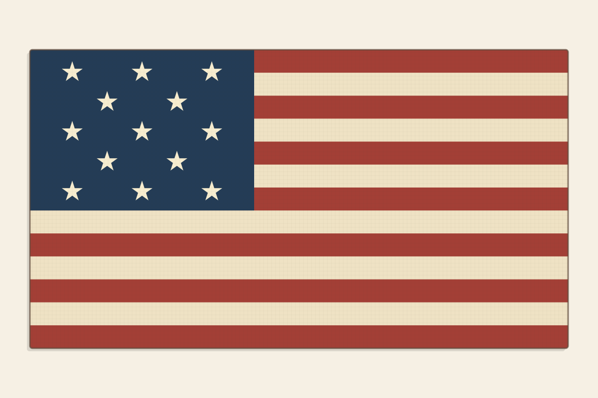
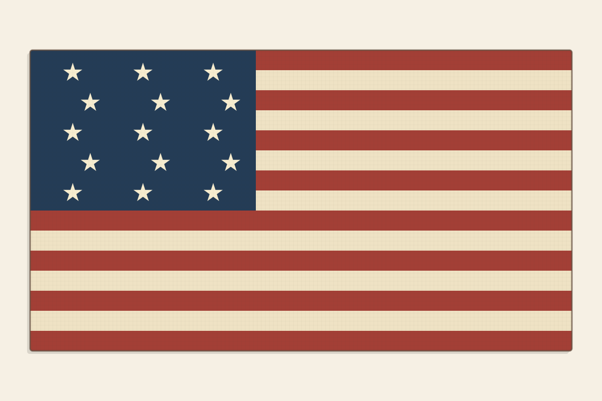

# Liberty in Action — American Flags Through the Years

<table class="flag-page">
  <tr>
    <td><strong>FLAG C</strong> </td>
  </tr>
  <tr>
    <td><strong>FLAG A</strong> </td>
  </tr>
</table>

<table class="flag-page">
  <tr>
    <td><strong>FLAG E</strong> </td>
  </tr>
  <tr>
    <td><strong>FLAG B</strong> </td>
  </tr>
</table>

<table class="flag-page">
  <tr>
    <td><strong>FLAG D</strong> </td>
  </tr>
  <tr>
    <td><strong>FLAG F</strong> </td>
  </tr>
</table>
