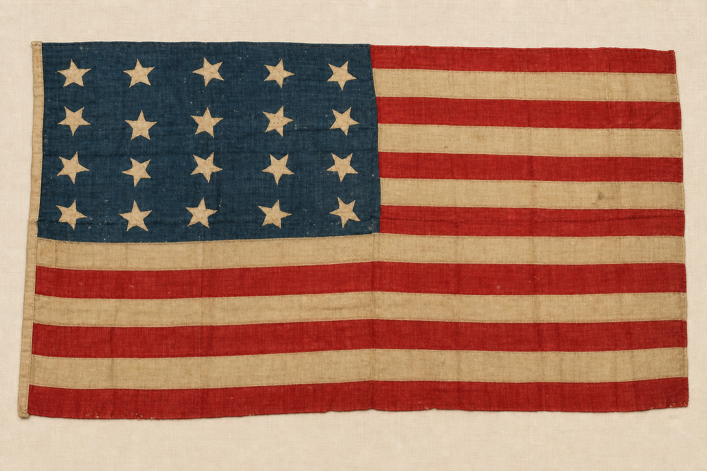
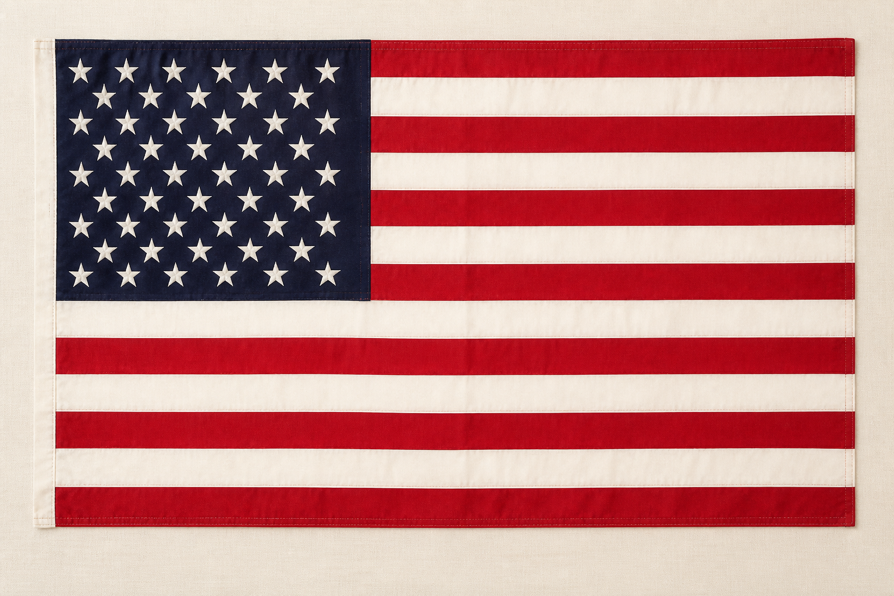
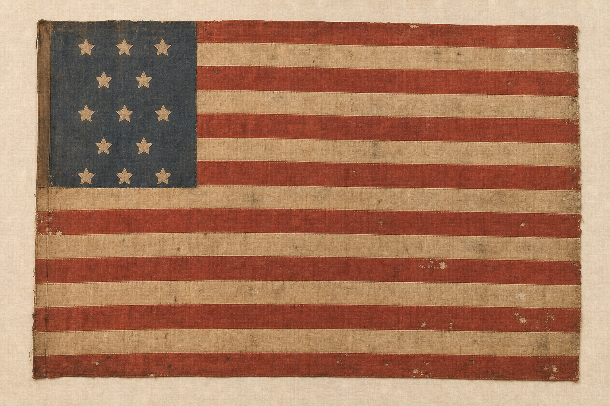
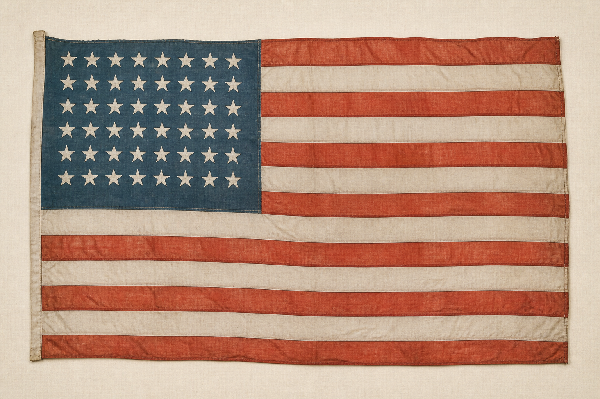
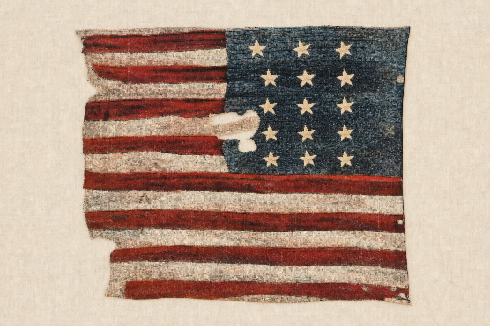

# Liberty in Action — History & Citizenship Printables

Print one leader copy of the story and answer key. Print the flag-card page in color and cut along the table borders. The five flag images use the same 3:2 canvas so the cards print at equal sizes.

## Leader Script — “The Decision for Independence”

### Audience Responses

- **CONGRESS** — Tap an imaginary gavel and say, “Order!”
- **COLONY** or **COLONIES** — Hold up both hands and say, “Thirteen together!”
- **INDEPENDENCE**, **INDEPENDENT**, or **FREE** — Raise both hands and say, “Choose our future!”
- **DECLARATION** — Pretend to unroll a document and say, “Hear the reasons!”
- **PRINT**, **PRINTED**, **PRINTER**, or **COPIES** — Press both palms down and say, “Ink to paper!”

### Story

Philadelphia was hot in the summer of 1776, and the meeting room of the Second Continental **CONGRESS** was crowded. Outside, the war with Great Britain had already begun. Inside, delegates from the **COLONIES** faced an enormous question: should the colonies become **INDEPENDENT** states?

On June 7, Richard Henry Lee of Virginia stood before **CONGRESS**. He proposed that the united **COLONIES** “are, and of right ought to be, free and independent States.” Some delegates were ready. Others had been told by their **COLONY** not to vote yet. **CONGRESS** postponed the decision while the delegates sought new instructions.

The question could not wait forever. **CONGRESS** appointed five people to prepare a **DECLARATION** explaining why the **COLONIES** might separate from Great Britain. Thomas Jefferson wrote the first draft. John Adams and Benjamin Franklin suggested changes. Then the committee presented the **DECLARATION** to **CONGRESS**.

On July 2, the delegates voted on Lee's resolution for **INDEPENDENCE**. Twelve **COLONIES** voted yes. New York did not vote because its delegates were still waiting for permission. The resolution passed: the united **COLONIES** had chosen to be **FREE** and **INDEPENDENT** states.

But the work was not finished. The delegates debated the words of the **DECLARATION**. They changed some passages and removed others. They wanted the document to announce their decision and explain their reasons to the world.

Late on the morning of July 4, **CONGRESS** adopted the **DECLARATION**. The document stated important ideals about equality, rights, and government by the consent of the governed. The committee carried the approved words to John Dunlap, the official **PRINTER** for **CONGRESS**.

That night, Dunlap's shop filled with the sounds of type, ink, paper, and the wooden **PRINT** press. By the morning of July 5, the first **PRINTED** broadsides were ready. Members of **CONGRESS** sent **COPIES** to assemblies, conventions, committees of safety, and commanders of Continental troops.

The famous parchment **DECLARATION** was prepared later. Most members of **CONGRESS** signed that copy on August 2, not July 4. Others signed still later.

The founding decision was not one quick scene. First came debate. On July 2 came the vote for **INDEPENDENCE**. On July 4 came the adopted words and the work of the **PRINTER**. Then the **COPIES** carried those words outward, and the signatures followed.

New York approved the action on July 9. The thirteen **COLONIES** had acted together. They had declared themselves **FREE** and **INDEPENDENT**, and they had given the world a **DECLARATION** of their reasons.

## Cut-Apart Flag Cards

The letters are deliberately out of chronological order. Do not write dates on the fronts.

These are museum-style educational reconstructions based on real historic flags or historical photographs. Their matching backgrounds and straight-on views were generated for this activity; they are not museum photographs.

|  |  |
| :---: | :---: |
| **FLAG C**  | **FLAG A**  |
| **FLAG E**  | **FLAG B**  |
| **FLAG D**  | **EARLIEST** ←————————→ **TODAY** |

## Leader Answer Key

This selected timeline is not every official version. It omits several designs, including the 49-star flag used from July 4, 1959, through July 3, 1960.

| Order | Card | Flag and period | Teaching fact |
| :---: | :---: | :--- | :--- |
| 1 | **E** | 13-star flag, 1777–1795 | The 1777 resolution required 13 alternating stripes and 13 white stars on blue, but did not specify the star arrangement. Card E uses a countable arrangement and textile character informed by a surviving circa-1790 flag. |
| 2 | **D** | 15-star, 15-stripe flag, 1795–1818 | Vermont and Kentucky brought the totals to 15. Card D is informed by the original Star-Spangled Banner that flew at Fort McHenry in 1814. |
| 3 | **C** | 20-star flag, 1818–1819 | Congress restored the number of stripes to 13 and provided one star for each state. Card C follows a surviving 1818 flag with four rows of five stars. |
| 4 | **B** | 48-star flag, 1912–1959 | President Taft standardized the stars into six rows of eight in 1912. Card B is informed by a 48-star parachute-silk flag made by American prisoners of war in Japan in 1945. |
| 5 | **A** | 50-star flag, July 4, 1960–present | Hawaii's admission supplied the 50th star. Card A is informed by a 1960 photograph of workers making the new flags, with nine staggered rows of six and five. |

## Quick Reveal Script

> **E** comes first: 13 stars and 13 stripes for the first 13 states. **D** comes next: when Vermont and Kentucky joined, both stars and stripes increased to 15. **C** shows the 1818 solution—return to 13 stripes and keep adding stars. Many designs followed. **B** has 48 stars in the first officially standardized arrangement. After a one-year 49-star flag, **A** became today's 50-star flag.

## Flag Image References and Credits

The printable images are original AI-generated educational reconstructions made for this station. Real artifacts and historical photographs supplied the design, material, age, and wear references. The uniform ivory backing, straight-on presentation, and complete countable star fields are interpretive. Do not present the card images as direct photographs of the objects.

- **Card E:** [13-star flag, circa 1790 — Tennessee State Museum](https://tnmuseum.org/TN225/artifacts/016), Tennessee Historical Society, accession 2.186.1. The surviving textile is heavily damaged; the card restores a clearly countable 13-star field in one historically possible arrangement.
- **Card D:** [The original Star-Spangled Banner — Library of Congress](https://www.loc.gov/pictures/item/2016821431/), National Photo Company Collection, LC-F81-2525. The source photograph has no known restrictions on publication.
- **Card C:** [U.S. 20-Star Flag, 1818 — Zaricor Flag Collection](https://www.flagcollection.com/itemdetails.php?CollectionItem_ID=3103), ZFC0625, Mastai—Early American Flags. The collection photograph was used only as a visual reference and is not reproduced in this repository.
- **Card B:** [Flag made by POWs flies over Bataan — DVIDS](https://www.dvidshub.net/image/9871073/flag-made-pows-flies-over-bataan), U.S. Navy photograph by MCSSA Jackson C. Rott. The source photograph is public domain.
- **Card A:** [Workers sewing 50-star flags, June 1960 — Library of Congress](https://www.loc.gov/pictures/item/2023631223/), photograph by John T. Bledsoe, LC-U9-4644-13. The source photograph has no known restrictions on publication.
