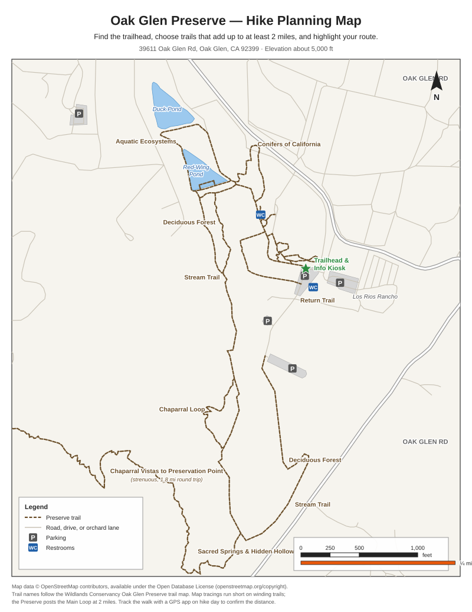
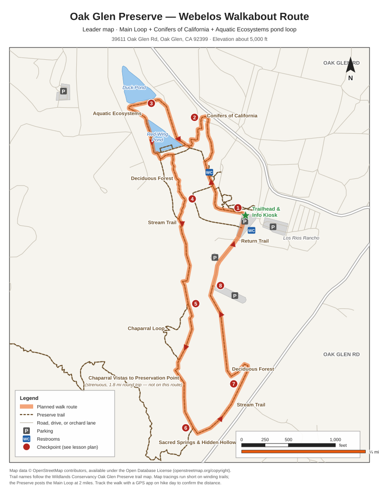

# Oak Glen Preserve Hike Maps and Site Guide

Site guide and printable maps for the Webelos Walkabout two-mile walk at the Oak Glen Adventure pack event. Used by the [Walkabout Lesson 1 planning meeting](../lessons/required/Webelos_Walkabout_Lesson_1_Hike_Planning_and_First_Aid.md) and the [Walkabout Lesson 2 pack hike](../lessons/required/Webelos_Walkabout_Lesson_2_Oak_Glen_Pack_Hike.md).

## Site Facts

| Item | Detail |
| :--- | :--- |
| Place | Oak Glen Preserve, home of the Southern California Montane Botanic Garden and Children's Outdoor Discovery Center (The Wildlands Conservancy) |
| Address | 39611 Oak Glen Rd, Oak Glen, CA 92399, across from Los Rios Rancho |
| Hours | 8:00 AM–5:30 PM April–October; 8:00 AM–4:30 PM November–March; closed Thanksgiving and Christmas |
| Admission | Free |
| Elevation | About 5,000 feet |
| Facilities | Parking, accessible parking, and restrooms. The Preserve map shows restrooms near the trailhead parking, along the Transition Trail, and near the south (Oak Knoll Park) parking area. |
| Rules | Dogs on leash. No bikes, e-bikes, fires, charcoal barbecues, smoking, alcohol, drones, hunting, or collecting. |
| Wildlife and plants noted by the Preserve | Mountain lions, black bears, rattlesnakes, and stinging nettle |
| Contact | (909) 790-3698 · oakglenpreserve@wildlandsconservancy.org |

Sources: [Oak Glen Preserve page](https://wildlandsconservancy.org/preserve/oak-glen-preserve/) · [Official Oak Glen Preserve trail map (PDF)](https://wildlandsconservancy.org/wp-content/uploads/2026/04/OakGlenPreserveTrailMap.pdf) · [AllTrails: Oak Glen Preserve Trails](https://www.alltrails.com/trail/us/california/oak-glen-preserve-trails)

## Trail Distances

| Trail | Distance | Source |
| :--- | :--- | :--- |
| Main Loop Trail | 2 miles | Preserve trail map |
| Main Loop plus all spur trails | 4.8 miles | Preserve trail map |
| Chaparral Vistas to Preservation Point | 1.8 miles round trip, strenuous out-and-back | Preserve trail map |
| Oak Glen Preserve Trails (loop) | 1.9 miles, about 357 feet of elevation gain, about 1–1.5 hours | AllTrails |

The Preserve map marks two **steep sections** on the Main Loop: the Stream Trail descent below the western Deciduous Forest, and the Stream Trail climb in the southeast corner before the eastern Deciduous Forest.

## Planned Route

**Main Loop + Conifers of California + Aquatic Ecosystems pond loop**, starting and ending at the trailhead and information kiosk beside the main parking lot.

The spurs add distance so the walk reaches 2 miles by any measurement. OpenStreetMap tracings of this route measure about 1.9 miles because map lines smooth out trail bends; the Preserve posts the Main Loop alone at 2 miles. Track the walk with a phone GPS app. If the tracker shows less than 2.0 miles back at the kiosk, walk the short garden loops beside the kiosk (Sunflower Lane, Pioneer Loop, and Hummingbird Hill) until it does.

| Checkpoint | Location | Approximate point in the walk |
| :--- | :--- | :--- |
| 1 | Trailhead and information kiosk — start | Start |
| 2 | Conifers of California | About 1/8 |
| 3 | Aquatic Ecosystems loop around Red-Wing Pond | About 1/4 |
| 4 | Deciduous Forest into the Stream Trail — steep descent | About 2/5 |
| 5 | Chaparral Loop junction — stay on the Main Loop | About halfway |
| 6 | Sacred Springs and Hidden Hollow at the Chaparral Vistas junction — do not take Chaparral Vistas | About 2/3 |
| 7 | Stream Trail — steep climb | About 3/4 |
| 8 | Deciduous Forest past Oak Knoll Park to the south parking area, then the Return Trail to the kiosk | About 9/10 |

## Scout Planning Map

Print one per Scout for Requirement 2. The map has a scale bar and north arrow; Scouts highlight their own route.

## Leader Route Map

Print copies for the den leader and the sweep adult. Numbered checkpoints match the table above.

## Map Credits

The planning and route maps were drawn from OpenStreetMap data (© OpenStreetMap contributors, [Open Database License](https://www.openstreetmap.org/copyright)). Trail names follow the official Preserve trail map. Print the [official Preserve trail map](https://wildlandsconservancy.org/wp-content/uploads/2026/04/OakGlenPreserveTrailMap.pdf) as well; paper copies are also available at the entrance kiosk.
